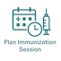
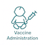
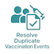
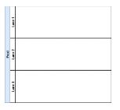
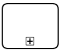
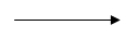
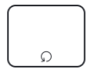

# Immunization DAK - Nigeria Core - FHIR Implementation Guide v0.0.0

* [**Table of Contents**](toc.md)
* **Immunization DAK**

## Immunization DAK

The interventions referenced in this Digital Adaptation Kit (DAK) are based on Nigeria's National Immunization Schedule and the World Health Organization's Universal Health Coverage list of essential interventions.

This DAK focuses on childhood routine immunization in Nigeria and describes the interventions, service-delivery activities, and recommended practices that should be supported by digital immunization systems.

### General Vaccine Administration Practices

General vaccine administration practices for eligible clients, including children, include:

* Counselling on the vaccine or vaccines to be administered, including the delivery of an appropriate health talk.
* Documentation of vaccinations received, including entries recorded on the Child Health Card.
* Documentation and reporting of immunizations administered.
* Observation for adverse events following immunization (AEFI).
* Targeted history-taking and physical examination before vaccination, where appropriate.
* Identification and tracking of clients who have defaulted from the immunization schedule.
* Scheduling and completion of follow-up visits.

### Nigeria Routine Immunization Schedule

The following vaccines and related interventions are included in Nigeria's routine childhood immunization schedule.

| | | | | |
| :--- | :--- | :--- | :--- | :--- |
| At birth | BCG | 0.05 mL | Intradermal | Left upper arm |
| OPV 0 | 2 drops | Oral | Mouth | |
| Hepatitis B birth dose | 0.5 mL | Intramuscular | Anterolateral aspect of the right thigh | |
| 6 weeks | Pentavalent 1 (DPT, Hepatitis B, and Hib) | 0.5 mL | Intramuscular | Anterolateral aspect of the left thigh |
| Pneumococcal Conjugate Vaccine 1 | 0.5 mL | Intramuscular | Anterolateral aspect of the right thigh | |
| OPV 1 | 2 drops | Oral | Mouth | |
| Rotavirus Vaccine 1 | 5 drops | Oral | Mouth | |
| IPV 1 | 0.5 mL | Intramuscular | Anterolateral aspect of the right thigh, at least 2.5 cm from the PCV injection site | |
| 10 weeks | Pentavalent 2 (DPT, Hepatitis B, and Hib) | 0.5 mL | Intramuscular | Anterolateral aspect of the left thigh |
| Pneumococcal Conjugate Vaccine 2 | 0.5 mL | Intramuscular | Anterolateral aspect of the right thigh | |
| OPV 2 | 2 drops | Oral | Mouth | |
| Rotavirus Vaccine 2 | 5 drops | Oral | Mouth | |
| 14 weeks | Pentavalent 3 (DPT, Hepatitis B, and Hib) | 0.5 mL | Intramuscular | Anterolateral aspect of the left thigh |
| Pneumococcal Conjugate Vaccine 3 | 0.5 mL | Intramuscular | Anterolateral aspect of the right thigh | |
| OPV 3 | 2 drops | Oral | Mouth | |
| Rotavirus Vaccine 3 | 5 drops | Oral | Mouth | |
| IPV 2 | 0.5 mL | Intramuscular | Anterolateral aspect of the right thigh, at least 2.5 cm from the PCV injection site | |
| 5 months | Malaria Vaccine 1 | 0.5 mL | Intramuscular | Deltoid region |
| 6 months | Vitamin A, first dose | 100,000 IU | Oral | Mouth |
| Malaria Vaccine 2 | 0.5 mL | Intramuscular | Deltoid region | |
| 7 months | Malaria Vaccine 3 | 0.5 mL | Intramuscular | Deltoid region |
| 9 months | Measles-Containing Vaccine, first dose (MCV1) | 0.5 mL | Subcutaneous | Left upper arm |
| Yellow Fever Vaccine | 0.5 mL | Subcutaneous | Right upper arm | |
| Meningitis Vaccine | 0.5 mL | Intramuscular | Anterolateral aspect of the left thigh | |
| 12 months | Vitamin A, second dose | 200,000 IU | Oral | Mouth |
| 15 months | Measles-Containing Vaccine, second dose (MCV2) | 0.5 mL | Subcutaneous | Left upper arm |
| Malaria Vaccine 4 | 0.5 mL | Intramuscular | Deltoid region | |
| 9 years | Human Papillomavirus Vaccine (HPV) | 0.5 mL | Intramuscular | Deltoid muscle of the upper arm |

### Timing Notes

* BCG should preferably be administered within two weeks of birth but may be administered up to 11 months of age.
* OPV 0 should be administered before the child reaches two weeks of age.
* The hepatitis B birth dose should be administered within 24 hours of delivery.

> **Scope note:** This DAK includes content for childhood routine immunization in Nigeria. Non-routine adult vaccination and vaccination campaigns are outside its current scope.

### Nigeria and Global Guidelines, Recommendations, and Guidance

The interventions described in this DAK draw primarily from Nigeria's national immunization policies, schedules, guidelines, registers, reporting tools, and programme recommendations. Where a relevant recommendation is not explicitly defined for Nigeria, applicable WHO guidance is used as the default reference.

The following documents and resources informed this DAK:

1. WHO recommendations for routine immunization.
1. Nigeria Immunization Schedule.
1. **Basic Guide on Routine Immunization for Service Providers in Nigeria**.
1. Draft National Immunization Policy.
1. Child Health Immunization Card.
1. Immunization registers used in Nigeria.
1. Immunization tally sheets used in Nigeria.
1. National Vaccine Policy.
1. **Nigeria Strategy for Immunization and Primary Health Care System Strengthening, 2018–2028**.
1. **Nigeria National Digital Health Information for Immunization and Primary Health Care Roadmap, 2023–2027**.
1. **Surveillance of Adverse Events Following Immunization: Field Guide**, 2011.

### Intended Audience and Reading Suggestions

The intended audience for this document includes:

* Business analysts.
* Routine immunization programme managers.
* Software developers and solution architects.
* Digital health implementers.
* Monitoring and evaluation personnel.
* Quality-assurance and conformance-testing teams.
* Trainers and other project personnel responsible for designing or adapting digital immunization workflows in Nigeria.

This document is intended to provide a clear description of Nigeria's routine immunization business processes and recommended interventions for use in the development, configuration, upgrade, maintenance, testing, and training of digital immunization systems.

Readers designing or evaluating a digital solution should use this page together with the DAK sections covering personas, user scenarios, business processes and workflows, decision-support logic, functional requirements, and non-functional requirements. Collectively, these sections define the expected system behaviour and provide a basis for verifying that an implemented solution functions as intended.

### Routine Immunization User Personas

A persona is a depiction of a relevant stakeholder, or end-user, of the system. In this section, the goal is to provide a clear depiction of the end-users, supervisors, and related stakeholders who would be interacting with the digital system or involved in the care pathway. The personas were derived from the Basic Guide on Routine Immunization for Service Providers in Nigeria and the [Digital Adaptation Kit for Immunization](https://iris.who.int/bitstream/handle/10665/380303/9789240099456-eng.pdf?sequence=1). It was further refined to reflect Nigeria by identifying the real user personas during the requirement gathering workshop.

| | | | |
| :--- | :--- | :--- | :--- |
| **NATIONAL** | | | |
| FMoHSW data users | Leads and coordinates insights-driven policy decision making with data from all the states in the country. National level Policy makers at FMoHSW (Please see appendix for full list and responsibilities) | Head of M&E, DHPRS program officers | 1112 |
| NPHCDA data users | Coordinates data-driven Routine Immunization activities. National level policy and operational decision makers at NPHCDA (Please see appendix for full list specific roles and responsibilities at NPHCDA that will use this designation) | Head of RI, DCI program officers | 1342 |
| **STATE** | | | |
| SMoH health data users | Use insights to make public health decisions at the state level. State level Policy makers at SMoH (Please see appendix for full list roles and responsibilities) | State HMIS Officer |  |
| SPHCDB health data users | State Primary Health Care Development Board (SPHCDB) stakeholders. Use insights to make immunization decisions at the state primary healthcare level. | State M&E officer |  |
| State Immunization Officer | Responsible for immunization communication and mobilization; management of logistics, the cold chain, and vaccines; monitoring, supervision, and evaluation of immunization services; and coordination of EPI activities at the national and subnational levels. | Program Manager/Coordinator, EPI Managers |  |
| **LGA** | | | |
| LGA health data users | Responsible for generating and interpreting data insights from health facilities, ensuring summaries are of good quality in the national repository. Conduct targeted supportive supervision. (see appendix for list of all users) | HoD Health, LIO, LGA CCO, LGA M&E etc. |  |
| **HEALTH FACILITY** | | | |
| Routine Immunization Service Provider | The RI service providers plan sessions, register clients, provide health talks, counselling, vaccinate, record, and provide other services to clients. Conduct outreaches as appropriate. They identify, treat, and report AEFI. AEFI reporting and treatment. Vaccine management at the facility. Etc. | RI Focal Person, [Registered Nurse, Midwife, Nurse, CHEW, JCHEW, Healthcare Worker] | 3221 |
| Officer In Charge (OIC) | Provide oversight and ensure resources are available, and oversee and supervise RI processes. Supervise data harmonization and validation. Facilitate higher level reporting. Attend technical and harmonization meetings. Lead defaulter tracking and reporting. Responsible for surveillance at the facility. Vaccine management. | Head of facility |  |
| Health Information Officer | Reviews monthly aggregate data in summary sheets format and ensure submission to LGA M&E. and other data reports. | Medical record officer |  |
| Community Health Worker | Provide health education, referral and follow up, case management, and basic preventive health care and home visiting for defaulter tracking to specific communities. | CHEW, JCHEW, Volunteers | 3253 |
| System administrator | A System Administrator at the health facility level helps to assign roles as appropriate to resources in the EIR to team members. | IT manager, Technical support staff, OIC | 2522 |
| Caregiver | This can be the mother, grandmother, father, guardian, carer of the child, infant, elderly, or disabled person. | Parent, Grand Parent, Guardian, Siblings | N/A |
| Client | The person who intends to receive vaccination services from the targeted health worker personas. A client who is 17 years of age or younger is considered a child | Infant, baby, child. | N/A |

### Description of settings:

| | | | |
| :--- | :--- | :--- | :--- |
| Health Facility | Designated location where vaccinations are administered to individuals. These sites are established and operated by healthcare organizations, government agencies, or other entities involved in public health efforts. Health Facilities can vary in size and setup. A health facility can be public or private, and can be either a primary, Secondary, or Tertiary level health facility. A healthcare facility may have multiple vaccination locations under it. | Teaching Hospital, General Hospital, Comprehensive Health Center, Primary Health Clinic, Health post. | N/A |

### Routine Immunization Use Cases (User Scenarios)

User scenarios are narratives that describe how the different personas may interact with each other and are intended to give an illustrative idea of a typical workflow. This section is intended to provide an understanding of how the system would be used, and how it would fit into existing workflows.

#### User scenario for Routine Vaccination

| | |
| :--- | :--- |
| Juliet, a 21-year-old mother, lives in a small village near Igboland with her husband and their 6-week-old daughter, Ann. Despite having only completed primary school, Juliet is deeply committed to ensuring Ann’s health and well-being. Ann was born at home, and her birth was not registered. Juliet took Ann to the local clinic shortly after birth for birth vaccines. At the Clinic, Juliet found Lucy who assessed Ann and deemed her eligible for vaccination. Lucy assigned Ann a unique identification number and issued Ann a child health card. She input Ann’s details including biodata, residential address, mother’s other children, vaccine schedule, weight and height. Lucy administered birth vaccines which included BCG 0.05ml intradermal, 2 drops of OPV0 orally, 0.5ml HepB intramuscular and recorded on the child health card the date of administration, batch number and date for next visit. Lucy then observed Ann for adverse events following immunization and discharged Juliet home with a reminder for the next visit.Six weeks later, Juliet reviews the child health card and sees that Ann is due for the 6-weeks vaccine. The clinic, located in Igboland, is over an hour’s walk from Juliet’s home. Despite the distance, Juliet appreciates the journey as it allows her to meet other new mothers and learn from the advice provided by the clinic’s nurse.The following morning, Juliet sets out with Ann to visit the Igboland clinic, arriving just after 9 a.m. The small waiting area is filled with five other mothers and their children. Juliet takes her seat, holding Ann close as she waits for her turn. When Lucy, the nurse-in-charge, calls Juliet in, Juliet hands over Ann’s child health card. Lucy takes the card and logs into the clinic’s electronic immunization registry (EIR) on her tablet.Using the unique ID from the card, Lucy retrieves Ann’s digital immunization record. Lucy updates Ann’s record by inputting Juliet’s details including name, telephone number, relationship, and next of kin. She then reviews it alongside the child health card and confirms that Ann is due for pentavalent, pneumococcal, OPV1, Rota 1 , and IPV1 vaccines that day. Before proceeding, Lucy weighs Ann on the clinic’s scale, carefully noting her weight. She records this information in both the vaccine card and the EIR, remarking that Ann’s weight gain is on track. She also takes time to address Juliet’s questions about breastfeeding and reassures her about Ann’s growth.Lucy then prepares the vaccines. She opens the cooler box, which she had stocked earlier that morning, and carefully checks the expiration dates and safety indicators on each vial. Confident in their safety, she begins administering the vaccines. Ann receives oral doses first, followed by injections. Juliet comforts Ann as Lucy completes the process.After the vaccinations, Lucy updates Ann’s digital record in the EIR and documents the details in the child health card. She explains to Juliet the importance of tracking both records to ensure continuity of care. Lucy then discusses the next steps, noting the date of Ann’s next immunization. She writes this information on the child health card and advises Juliet to aim for the suggested date, reassuring her that arriving within a day or two is still acceptable. Lucy also explains how to manage mild side effects, like fever, that Ann might experience after the vaccines. As a final step, Lucy tells Juliet that she will get a reminder notification a day before the due date for the upcoming vaccinations.Feeling reassured by Lucy’s guidance and support, Juliet leaves the clinic with Ann. She is confident in her ability to care for her daughter and is grateful for the well-organized services that help her keep Ann healthy. The clinic’s integrated system ensures that Ann’s immunization schedule is well-documented, and the SMS reminders will help Juliet stay on track for future visits. | |
| Business Processes | * Registration
* Administer vaccine
* AEFI monitoring
* Client reminder
 |

#### User scenario for Defaulter Tracking

| | |
| :--- | :--- |
| Lucy, the nurse responsible for the under-5 clinic in Igboland, is tasked with ensuring that all children in her clinic’s catchment area are vaccinated. The estimated number of children is derived from the population served by her clinic, the only healthcare facility in the region. To achieve her goal, Lucy collaborates closely with Susan, a respected community health worker.The introduction of the EIR has significantly reduced Lucy’s administrative burden. Previously, she spent hours each week manually reviewing the paper immunization registry to identify children who were overdue for vaccinations, calculating their status based on recorded dates. Every end month, Lucy generates a list of defaulters from the system. She sends this list to the community health worker via SMS. Susan does defaulter tracking in her catchment area. In her list, Ann who was due for her 10 weeks vaccine, is first on the list.She finds the location and phone number of Juliet, Ann’s mother from the list. She knows the location well and finds her way to Juliet’s house. She finds Juliet sun-bathing Ann and confirms Juliet’s identification. Susan introduces herself and the reason for her visit. Juliet warmly welcomes her and offers her a seat. She explains to Susan that she had travelled and did not remember to take Ann to the facility for her routine immunization. Susan emphasizes the importance of immunization on the child’s health and encourages Juliet to visit the health facility the next morning. Juliet agrees to take Ann to the facility as she bids Susan goodbye.The next morning, Juliet takes Ann to the facility where Ann receives her immunization. Lucy updates her records and Ann’s name is taken off the defaulter list. | |
| Business Processes | * Defaulter tracking
* Report generation 
 |

#### User Scenario for Catch-up campaign

| | |
| :--- | :--- |
| Dr. Sade has been serving as the Expanded Program on Immunization (EPI) Manager in Lagos state for the last decade. In his role, he is responsible for planning and overseeing the immunization programs at all the facilities within his state. He supports these facilities, reviews data, and ensures that the programs are running efficiently. Dr. Sade regularly monitors the monthly immunization reports submitted by each facility, looking for potential issues such as inaccurate data, low vaccine coverage, or vaccine stockouts that may disrupt the clinics' operations. He also keeps track of the target population of children in the state and maps where these children are located. Recently, Dr. Sade noticed that the polio vaccination coverage was significantly lower than expected across several facilities.During a workshop last month, Dr. Sade and other EPI Managers were informed about a national initiative to conduct local catch-up vaccination campaigns to address this issue. These campaigns were planned to be larger in scope due to the significant number of overdue vaccinations. While the state had previously carried out smaller catch-up activities, such as during Child Health Week or Immunization Days, this campaign was expected to be more extensive. Dr. Sade’s task was to adapt the national plan for his state, manage the budget, and supervise the campaign’s implementation. He worked closely with various stakeholders to coordinate activities, while also ensuring that the community was engaged and well-informed about the campaign.Lydia and her team designed a vaccination strategy that included both fixed-site clinics and mobile vaccination teams to reach urban and rural areas across Lagos. The goal was to vaccinate all children under five years old in the affected areas within three weeks. To ensure that the community was fully aware and engaged, community health workers and healthcare providers held town hall meetings, distributed flyers, and conducted radio broadcasts. These efforts helped explain the importance of the polio vaccination and address concerns and misconceptions, using endorsements from trusted local leaders and healthcare professionals to build confidence in the vaccine.In preparation for the campaign, the National Primary Health Care Development Agency (nphcda) provided healthcare workers with training on vaccine administration, cold chain management, and accurate data recording. Vaccines were distributed to health centers and mobile teams, ensuring that the cold chain was maintained from the national storage facility to local sites.The campaign kicked off with a highly publicized launch event, after which both fixed-site clinics and mobile vaccination units began administering the oral polio vaccine (OPV). Healthcare workers visited households, schools, marketplaces, bus stations, and remote villages to ensure that no child was left unvaccinated. Vaccination teams used the Electronic Immunization Registry (EIR) to record data in real time, allowing for immediate monitoring and adjustments as needed.Anita, a community registered worker, was one of the healthcare providers involved in the immunization campaign. During a visit to Igboland village, she met Martha, the mother of a 2-year-old boy named Eric. Anita explained the ongoing polio vaccination campaign to Martha, who was already aware and gave her consent to vaccinate Eric. When Anita searched for Eric’s record in the EIR using his birth certificate number, she couldn’t find it. Martha, however, showed Anita the child’s vaccination history in the vaccination card, confirming that Eric had already been vaccinated. Anita then registered Eric in the EIR, updated his immunization record, administered the oral polio vaccine, and saved the data.The healthcare providers continued with the immunization efforts over the course of the next three weeks. At the end of the campaign, they returned all tools and equipment to the health centers. County health authorities and NVIP conducted post-vaccination surveillance to monitor for any adverse events and verify that the campaign’s coverage targets had been met.Lydia and her team conducted an evaluation of the campaign's success based on the vaccination coverage data and the containment of the polio outbreak. A detailed report was compiled, highlighting the outcomes and lessons learned from the campaign. | |
| Business Processes | * Catch-up campaign
* Report generation
 |

#### User Scenario for Report Generation

| | |
| :--- | :--- |
| John is the Abuja State EPI. He is 35 years old and has a university degree in management. He has been the state EPI for the last 6 years. John is responsible for planning, and supporting all of the facilities in his state to manage their immunization programs, supervising and conducting reviews of data of immunization programs in Abuja. He closely monitors the monthly reports that each facility sends and looks for potential issues that may require his attention, such as inaccurate data on the reports or situations where the overall vaccine coverage in a facility may be lower than their targets, or if they have had times where they do not have a vaccine in stock to run their clinics. John is also responsible for keeping track of the target population of children in his state and a sketch map of where that population is found. Abuja, like the rest of the region, has had significant challenges due to the COVID-19 pandemic. Many parents did not bring their children for their routine vaccinations for fear of contracting COVID-19. As a result, John has noticed their coverage rates for most vaccines are much lower. John logs in to EIR with his credentials to generate monthly vaccination reports for his state. He generates the reports and during the analysis, he realizes there are still many children who are overdue for their vaccines. John shares the report with his colleagues and plans for some local outreach campaigns as part of a coordinated national plan to address this issue. John and his team have conducted these outreach campaigns previously, typically one or 2 times a month during Child Health Week events or Immunization Days. Since this campaign will be larger due to the number of overdue vaccines, the National Vaccine Immunization Program is working with other partners to offer additional support. John has the responsibility to review the plan made by the national government for the campaign in his region, review the budget, and supervise the implementation of the campaign. John works closely with stakeholders (coordination) and the community (communication) to implement the sub-county’s immunization plans.  | |
| Business Processes | * Report generation
 |

#### User Scenario for Contraindication

| | |
| :--- | :--- |
| Chioma is a hardworking 30-year-old businesswoman. Her child, Favour, is due for the 14-week vaccination. She wakes up early to prepare Favour for her clinic then rush back to her business. If she is late for the clinic, there will be a long queue, and Chioma does not wish to spend her day at the clinic. At the health facility, she finds 2 mothers in the queue. She finds a seat and waits for her turn. Before long, it is Favour’s turn. Favour’s vaccination card was screened to determine what vaccines she is eligible for. As she prepares Favour for her vaccination, Obi asks her if Favour had any reaction after the last vaccination. Chioma casually mentions to Obi that after the last two vaccinations, Favour had a severe rash on her leg and Chioma had to rush her to the nearest private clinic. Obi reassured her and documented it in the AEFI form, he also counselled Chioma that in the event of subsequent reactions, she should bring the child immediately back to the health facility for proper management and documentation. Obi administered the Penta 3, IPV2, Rota 3, PCV 3, OPV 3 antigens, updated Favour’s child health card, documents in the relevant data tools and reminds Chioma of the next visit. Chioma is done with the clinic visit and leaves satisfied to attend to her business.  | |
| Business Processes | * Register
* Contraindicated
 |

#### User Scenario for Adverse Event Following Immunization - AEFI

| | |
| :--- | :--- |
|  It's a humid Wednesday afternoon, and Zainab has just finished vaccinating a group of infants when a distressed mother, Hauwa, rushes in carrying her 9-month-old daughter, Aisha. The baby received the Measles 1, MenA and Yellow fever vaccines a few hours before and now has a high fever and won't stop crying. Hauwa explains that Aisha has been unusually irritable and developed some swelling at the injection site. Zainab quickly noticed that the baby's right arm where she received the Yellow Fever vaccine injection was swollen and red, and felt very hot to the touch. The facility's only working thermometer showed 39.5°C. This is clearly an adverse event following immunization (AEFI) case Drawing from her experience, Zainab first tries to calm Hauwa while conducting a quick assessment. She notices that despite the fever and swelling, Aisha is still alert and taking breast milk. She gives Aisha paracetamol. This is the only medication available and she knows Hauwa does not have money to go to the nearest referral health facility which is 30 kilometers away. She gets information of where she lives to give to the community health worker to visit her at home the next day. She provides counseling to Hauwa on the management of the symptoms and reassures her that she did the right thing in coming to the health facility to report. Zainab asks for the child's immunization card only to discover that Hauwa, in her panic, left it at home. Zainab used the Immunization register to confirm Hauwa’s last clinic visit and the batch number of the vaccine administered - crucial information for AEFI reporting. In the facility's AEFI forms (reporting and line listing), Zainab documents everything she observes: Onset of symptoms, current temperature, size of injection site swelling, baby's alertness level. Hauwa goes home and the next day the community health worker does a home visit. She finds Aisha’s fever has subsided and the swelling has also decreased.  | |
| Business Processes | * Registration
* AEFI reporting and Line listing
 |

#### User Scenario for HIV client Immunization

| | |
| :--- | :--- |
|  It's Monday morning when Mrs. Adekunle quietly approaches Bola's immunization desk after most other mothers have left. She whispers Tunde is 9months, HIV positive and is due for the yellow fever vaccine. Bola pulls her aside and asks for Tunde’s child immunization card. She reviews Tunde's growth chart and notices he's been growing well. She looks for any signs of illness or severe thrush. Her assessment of Tunde shows that he is asymptomatic hence she can safely administer the vaccines. If Tunde had shown any HIV symptoms, then the yellow fever vaccine would not have been administered. Bola administered Yellow fever, and other co-administered vaccines at 9 months (Measles, and MenA). She records in the immunization register, tally sheet and the child health card as she reminded Mrs Adekunle of the importance of keeping to the immunization schedule and advises her to always mention Tunde's HIV exposure status to healthcare workers. Mrs.Adekunle is happy with the advice and promises to do her best.  | |
| Business Processes | * Registration
* Administer vaccine
 |

#### User Scenario for Stock Management

| | |
| :--- | :--- |
|  Mary is a health worker in Lavane health facility in Abuja state. During her weekly stock count review, she notices that pentavalent vaccine is below the minimum count. She needs to order for the vaccines from the state vaccine depot. She fills in the ordering form capturing the vaccine and quantity needed. She sends the ordering form to the state depot and monitors the status for the vaccines. At the depot, Helen is the vaccine admin in Abuja. She receives the vaccine order from Lavane health facility. After confirming that vaccine is available, she accepts the order. She fills in the dispatch form indicating the vaccine and quantity released. Mary, on the other hand, receives the vaccines and fills in the form indicating the vaccine name, batch number, expiry date and the manufacturing company.  | |
| Business Processes | * Stock Management
 |

#### User Scenario Interpretation for Functional Requirements

 User scenarios are helpful tools not only to better understand the context in which a digital tool would operate but also to provide some insights into what key data elements would need to be recorded and accounted for in the database. Additionally, the context in which the tool would be used, illustrated by the user scenarios, provides insight into some functional and non-functional requirements that the system would also need. For example, in the table below based on the user scenarios described above, the first column highlights the key data elements that need to be recorded and/or calculated. The second column highlights some elements of decision-support logic that can be automated in the system. The third column displays some key functional and non-functional requirements that should be included in the system. The table below provides an example of a breakdown of these three elements extracted from the user scenario above. 

### Interpretations

#### Table 1: Interpretation of the routine vaccination 

| | | |
| :--- | :--- | :--- |
| * Unique ID
* Name
* Date of birth
* Vaccine given
* Date vaccine given
* Weight
 | * Determine what vaccines are due at this time (taking into account, the last vaccine date, and national vaccine schedule)
* Determine if weight is appropriate for age based on standardized growth charts (age calculated by date of birth)
* Determine when the next vaccines are due (taking into account, the last vaccine date, and the national vaccine schedule)
* Determine if the due date of the vaccine is within a few days 
 | * Ability to automatically generate SMS messages based on trigger events
* Indicate consent to receive reminders 
* Indicate dissent to receive reminders if the default is to receive reminders and there is an opt-out option
* Send reminders only to those who have given consent
 |

#### Table 2: Interpretation of the defaulter tracing

| | | |
| :--- | :--- | :--- |
| * Catchment area population (entered by system admin)
* Name
* Date of Birth
* Sex
* Parent/contact name
* Parent/contact phone number
* Address/Location
* Vaccine given
* Vaccine given date
 | * Determine which vaccines are due at this time (taking into account, the last vaccine date, and national vaccine schedule)
* Determine any vaccine past due (by more than a set number of days)
 | * Generate a list of children due (or overdue) for a vaccine within a specific time frame
* Generate a list of children due (or overdue) for a vaccine within a specific catchment area
* Send list of overdue children to the specific phone number associated with the catchment area
* Ability to automatically generate SMS messages based on trigger events
 |

#### Table 3: Interpretation of catch-up campaign

| | | |
| :--- | :--- | :--- |
| * Target population (estimated from census projections)
* Coverage rates (the vaccines given divided by the target population) 
* Address of client
 | * Determine what vaccines are past due at this time (taking into account, date of birth, last vaccine date, and national vaccine schedule) 
* Determine if overall coverage is below the target
* Calculate the stock needed to provide for those who are imminently due and overdue for vaccination 
* Determine where the target population is located (based on the clinic they are associated with as well as their address)
 | * Ability to generate monthly reports of vaccine coverage rates
* Ability to generate ad hoc report
* Ability to sort and filter reports by vaccination location, address, and other attributes as needed
 |

### Routine Immunization Business Processes

A business process, or process, is a set of related activities or tasks performed together to achieve the objectives of the health Programme area, such as registration, counseling, and referrals. Workflows are a visual representation of the progression of activities (tasks, events, and interactions) that are performed within the business process. The workflow provides a story for the business process being diagrammed and is used to enhance communication and collaboration among users, stakeholders, and engineers.

The business processes here have been informed by [ WHO Digital adaptation kit for immunizations.](https://www.who.int/publications/i/item/9789240099456)

#### Table 2: Overview of Business Processes

| | | | | | |
| :--- | :--- | :--- | :--- | :--- | :--- |
|  | Title | ID used to reference this process throughout the DAK | Individuals interacting to complete the process | A concrete statement describing what the process seeks to achieve | The general set of activities performed within the process |
| A | Health Facility Registration | IMMZ.A | System administrator | All vaccinator locations (public and private facilities) able to administer vaccines should be registered and uniquely identified to allow appropriate tracking of vaccine coverage and stock. | Starting point: The system administrator registers a new vaccination location (e.g, a PHC).* Validate against the National Master Facility List/Health Facility Registry (MFL/HFR).
* Notify NMFL of changes/updates.
* Request and submit additional information.
* Create and update vaccination location record.
* Generate EIR Unique identifier for vaccination.
* Send vaccination location registration notification.
 |
| B | Plan immunization session | IMMZ.B | Health worker | In preparation for a vaccination session, ensure sufficient supply and plan their workload. | Starting point: The health worker reviews vaccination records to determine vaccine needs estimates.* Record details on the planning sheet.
* Order additional stock.
* Record stock received.
* Assemble all needed materials for vaccination.
 |
| C | Client Registration | IMMZ.C | Health worker | To create, retrieve and/or update a Client's lifelong vaccine record in the EIR (or Immunization module in EMR) to support future vaccine administration. | Starting point: The Client arrives at the vaccination point and the health worker locates the client’s immunization history.* Search for the Client’s record via the EIR or Immunization module in EMR.
* Review and update the Client’s record.
* Create new Client records as required.
* Save the record.
 |
| D | Administer Vaccine | IMMZ.D | Health worker | To determine what vaccines a Client needs, administer those and record the data both in the system and the client’s home-based vaccination record. | Starting point: The Client has been registered in the system.* Capture or query Client’s record.
* Determine Client’s vaccination eligibility (also check contraindication).
* Verify the required vaccines.
* Prepare and administer vaccines.
* Monitor the Client for any adverse effects following vaccination.
* Inform the Client when to return for vaccination/set Client reminder.
* Provide Client with vaccination card
 |
| E | Client reminder | IMMZ.E | Health worker | This is to remind clients that it is time to return for vaccination. | Starting point: The Client’s records are evaluated to determine if they meet the defined criteria to recieve reminders.* Select notification method.
* Generate a list of clients.
* Send reminder notifications.
 |
| F | Defaulter tracking | IMMZ.F | Community health worker | To identify clients that are overdue for follow-up. | Starting point: Clients are overdue for vaccination.* Determine if and which vaccines were missed.
* Generate a list of cCients and their contact information.
* Send the Client’s info to the respective CHPs.
* Plan for and conduct follow-up.
 |
| G | Resolve duplicate Client records | IMMZ.G | Health Facility Systems Administrator | To ensure accurate and unified client data by identifying and merging duplicate records. | Starting point: Flag duplicate client records for evaluation and resolution.* Review duplicate Client records.
* Determine if the duplicate records can be merged.
* Merge records.
 |
| H | Resolve duplicate vaccination events | IMMZ.H | Routine immunization service provider | To maintain reliable immunization records by detecting and resolving duplicate vaccination entries. | Starting point: Identify groups of vaccination events for evaluation and resolution.* Review duplicate events
* Select the most accurate/suitable event record.
* Update vaccination event.
 |
| I | Report generation | IMMZ.I | Health worker | To provide data access and analysis for decision-making. | Starting point: Define the reporting parameters.* Generate report.
* High-level review and analyze.
 |
| J | Manage and Report AEFI | IMMZ.J | Health worker | To monitor, record, and report AEFI. | Starting point: The Client reports AEFI or present with AEFI complaint at health facility* The health worker searches the record and records the AEFI against the vaccine administered.
* Monitor and Report any AEFI as appropriate
* Counsels the Client and treats them appropriately.
* Advises Client on when to come for the next vaccine.
 |

#### Table 3: Business process symbols used in workflows

| | | |
| :--- | :--- | :--- |
|  | Swim lane | Each individual or type of user is assigned to a swim lane, a designated area for noting the activities performed or expected of that specific actor. For example, a family planning health worker may have one swim lane; the supervisor would be in another swim lane; the clients/patients would be classified in another swim lane. If the activities can be performed by either actor, then those activities can be depicted overlapping the two relevant swim lanes. |
|  | Start event or Trigger event | The workflow diagram should contain both a start and an end event, defining the beginning and completion of the task, respectively. |
|  | End event | There can be multiple end events depicted across multiple swimlanes in a business process diagram. However, for diagram clarity, there should only be one end event per swim lane. |
|  | Activity, Process, Step or Task | Each activity should start with a verb, e.g., “Register client”, “Calculate risk”. Between the start and end of a task, there should be a series of activities noted - in the successive actions performed by the actor for that swim lane. There can also be sub-processes within each activity. |
|  | Activity with sub-process | This symbol denotes an activity that has a much longer sub-process, to be detailed in another diagram. If the diagram starts to become too complex and unhelpful, the sub-process symbol should be used to reference this sub-another process depicted on another diagram page. (Activity with sub-process in grey box is not covered in this DAK). |
|  | Sequence flow | This symbol denotes the flow direction from one process to the next. The end event should not have any output arrows. All symbols (except the Start event) may have an unlimited number of input arrows. All symbols (except the end event and the Gateway) should have one and only one output arrow, leading to a new symbol, looping back to a previously used symbol, or pointing to the End event symbol. Connecting arrows should not intersect (cross) each other. |
|  | Gateway | This symbol is used to depict a fork, or decision point, in the workflow, which may be a simple binary (for example, yes/no) filter with two corresponding output arrows or a different set of outputs. In this document, there should typically be only two different outputs that originate from the decision point. If you find yourself needing more than two “output” or sequence flow direction arrows, this is most likely trying to depict “decision-support logic” or a “business rule”. This should be depicted as an “Activity with business rule”. |
|  | Throw – Link | The “Throw–Link” serves as the start of an off-page connector. It is the end of the process when there is no more room on your page for that workflow. It is the end of a process on your current page or the end of a sub-process that is part of a larger process. When used, there will need to be a corresponding “Catch–Link” on the other page that shows the continuation of the workflow that follows the “Throw–Link”. |
|  | Catch – Link | The “Catch–Link” serves as an off-page connector. It is the start of a new process that follows a previous process, a continuation of a process from a previous page, on a different page from the “Throw – Link” or the start of a sub-process that is part of a larger process. Every “CatchLink” needs to align with at least one corresponding “Throw–Link” that is aligned to the prior process diagram “Catch–Link”. |
|  | Loop Activity | This “Loop Activity” or loop task symbolizes an activity or task that is repeated until it no longer needs to be repeated. For example, vaccine administration can happen as many times as the number of vaccines that need to be given. |

The overview of the business processes in this DAK captures all business processes at a high level.

#### Workflows

##### Health Facility Registration

** Objective: ** To register and uniquely identify vaccination locations in order to administer vaccines and enable appropriate tracking of vaccine coverage and stock.

##### Plan Service delivery

** Objective: ** To prepare for an immunization session, either at the vaccination location or done at an outreach site.

##### Client registration

** Objective: ** To start the client’s lifelong immunization record.

##### Vaccine administration

** Objective: ** To determine what vaccines a client needs, administer those, and record the data both in the system and on the client’s vaccination card.

##### Client reminder

** Objective: ** To send vaccination reminders to community health workers that certain clients are due for vaccination.

##### Defaulter tracing

** Objective: ** To identify clients that are overdue for follow-up

##### Resolve duplicate client record

** Objective: ** To ensure accurate and unified client data by identifying and merging duplicate records.

##### Resolve duplicate vaccination events

** Objective: ** To maintain reliable immunization records by detecting and resolving duplicate vaccination entries.

##### Report generation

** Objective: ** To provide data access and analysis for decision-making

##### Manage AEFIs

** Objective: ** To manage caregiver reports or client presenting at health facilities with cases of AEFI based on set triggers.

### Routine Immunization Core Data Elements

This page outlines the core set of data elements corresponding to different points of the workflow within the identified business processes. These data elements provide the foundation for executing the decision-support logic, as well as populating indicators and performance metrics.

[View the Core Data Elements](https://docs.google.com/spreadsheets/d/112uE3VyxULtjtsiEK56JGE6kn2I-3Epn/edit?gid=1858854187#gid=1858854187)

The data elements in the data dictionary have been extracted from different registers and forms shared as indicated [here](https://docs.google.com/spreadsheets/d/1a-7n7pd2f4AVteTOWLnR7aFx2bdjcTtz/edit?gid=365633507#gid=365633507).

### Routine Immunization Decision Support logic

The decision-support logic component of the adaptation kit provides the decision-support logic and algorithms, as well as the scheduling of services, in accordance with WHO guidelines. In this DAK, the decision logic and algorithms deconstruct the recommendations within the immunization guidelines and guidance into a format that clearly labels the inputs and outputs that would be operationalized in a digital decision-support system.

See the complete Decision Support Logic sheet [here](https://docs.google.com/spreadsheets/d/19B93vm6ll4rV8cieo-2I99-Wrm8ur8tA)

### Routine Immunization Functional Requirements

Functional requirements describe the capabilities a digital tracking and decision-support system must have to meet end-users’ needs and support tasks within the business process. These requirements define essential system functions such as user management, data collection, patient tracking, decision support, reporting, system integration, and inventory management. They ensure the system facilitates accurate data entry, automates workflows, provides actionable insights, and integrates with relevant healthcare systems for seamless operations.

| | | | | |
| :--- | :--- | :--- | :--- | :--- |
| Business process A: Health Facility Registration | | | | |
| IMMZ.FXNREQ.001 | IMMZ.A1.Obtain vaccination location information | State Immunization Officer | The EIR system to be integrated with other existing registries | I will know about new vaccination locations and be informed about any updated information |
| IMMZ.FXNREQ.002 | IMMZ.A2.Update/anew vaccination location | Routine Immunization Service Provider/Medical Records Officer | The system to allow manual insertion of a new vaccination location | I can add and use vaccination locations not in the system |
| IMMZ.FXNREQ.003 | IMMZ.A3.Digitize REW microplans | State Immunization Officer | The system to have digitized REW microplans | Plans can be automatically generated for each outreach session |
| IMMZ.FXNREQ.004 | IMMZ.A4.Verify information for additional data | Routine Immunization Service Provider/Medical Records Officer | The system to verify all required vaccination location information is complete | Any missed fields can be identified |
| IMMZ.FXNREQ.005 | IMMZ.A5.Generate unique location identifier | State Immunization Officer | The system to generate a unique code for each vaccination location | The vaccination location will have a unique identifier in the EIR system |
| IMMZ.FXREQ.006 | IMMZ.A6. Generate Geo coordinates | State Immunization Officer | The system to have geo mapping capabilities | The vaccination locations can be easily identified |
| IMMZ.FXREQ.007 | IMMZ.A7.Obtain Contact information of focal persons | State Immunization Officer | The system to include the phone number and email address of the focal person | I can easily contact the focal person |
| IMMZ.FXREQ.008 | IMMZ.A8.Record vaccination location details | State Immunization Officer | The system to record vaccination dates, type of facility (public, private, secondary, tertiary) and type of site (fixed, outreach) | The exact vaccination location details are captured |
| Business process B: Plan service delivery | | | | |
| IMMZ.FXNREQ.009 | IMMZ.B1.Review past vaccination records to estimate vaccines needed | Routine Immunization Service Provider/Medical Records Officer | To identify, by checking the information in the system, all clients that are due (or overdue) for vaccination by the next immunization session date | I can plan my immunization session |
| IMMZ.FXNREQ.010 | IMMZ.B2.Review past vaccination records to estimate vaccines needed | State Immunization Officer | To sort the list of needed vaccines by antigen | I know how much of each vaccine is needed |
| IMMZ.FXNREQ.011 | IMMZ.B3.Record details on planning sheet | State Immunization Officer | To be able to check in the system the available stock at my vaccination location or at the local storage area/warehouse | I can determine the stock available for use |
| Business process C: Client registration | | | | |
| IMMZ.FXNREQ.012 | IMMZ.C1.Query client record | Routine Immunization Service Provider/Medical Records Officer | To search for a client using at least two identifying information | I improve my chances of finding a match and distinguishing between similar records |
| IMMZ.FXNREQ.013 | IMMZ.C1.Query client record | Routine Immunization Service Provider/Medical Records Officer | To search for the client record given some demographic information | I can find the client record if I do not have the unique ID |
| IMMZ.FXNREQ.014 | IMMZ.C1.Query client record | Routine Immunization Service Provider/Medical Records Officer | The system to return all potential matches based upon search criteria | I can find the best match |
| IMMZ.FXNREQ.015 | IMMZ.C1.Query client record | Routine Immunization Service Provider/Medical Records Officer | The ability for searches to include results that look or sound similar to the search term (phonetic search) | I can find something that may be spelt incorrectly |
| IMMZ.FXNREQ.016 | IMMZ.C1.Query client record | Routine Immunization Service Provider/Medical Records Officer | The system to prompt a search for the client (check if it is already in the system) prior to starting a new record | Duplicates are prevented |
| IMMZ.FXNREQ.017 | IMMZ.C1.Query client record | Routine Immunization Service Provider/Medical Records Officer | The system to retrieve and display, as a search result, a specific set of data (demographic information/photo/unique ID, etc.) | I can select the correct record |
| IMMZ.FXNREQ.018 | IMMZ.C1.Query client record | Routine Immunization Service Provider/Medical Records Officer | The system to display the most probable matches at the top of the list | I can review them first |
| IMMZ.FXNREQ.019 | IMMZ.C2.Create client record | Routine Immunization Service Provider/Medical Records Officer | The system to enforce a minimal required data set for new registrations | Sufficient data is entered to be able to identify the client |
| IMMZ.FXNREQ.020 | IMMZ.C2.Create client record | Routine Immunization Service Provider/Medical Records Officer | To select the vaccination location of the client from a list of locations | Entry errors are prevented |
| IMMZ.FXNREQ.021 | IMMZ.C2.Create client record | Routine Immunization Service Provider/Medical Records Officer | The system to uniquely identify every client using a system-generated unique identifier or an existing identifier (e.g. national ID, client ID) | The client can be definitively identified using that number |
| IMMZ.FXNREQ.022 | IMMZ.C3.Validate client details | Routine Immunization Service Provider/Medical Records Officer | To be able to modify appropriate client data as needed | The record contains up-to-date information |
| IMMZ.FXNREQ.023 | IMMZ.C3.Validate client details | Routine Immunization Service Provider/Medical Records Officer | The system to track that I have changed an existing record | Accountability for data modification is ensured |
| IMMZ.FXNREQ.024 | IMMZ.C3.Validate client details | Routine Immunization Service Provider/Medical Records Officer | The system to identify changes made to the record for my confirmation before saving | I can have the opportunity to double-check the data to prevent entry errors |
| Business process D: Administer vaccine | | | | |
| IMMZ.FXNREQ.025 | IMMZ.D1.Capture or update client history | Routine Immunization Service Provider/Medical Records Officer | The system to provide a history of previous care (including previous vaccination records) | I have access and review client's history |
| IMMZ.FXNREQ.026 | IMMZ.D1.Capture or update client history | Routine Immunization Service Provider/Medical Records Officer | To add client's health history (including previous vaccination records) | I can appropriately determine which vaccinations are required |
| IMMZ.FXNREQ.027 | IMMZ.D2.Determine required vaccination(s) | Routine Immunization Service Provider/Medical Records Officer | The system to display vaccines due according to predefined vaccine protocol | I can assess which vaccines need to be administered |
| IMMZ.FXNREQ.028 | IMMZ.D2.Determine required vaccination(s) | Routine Immunization Service Provider/Medical Records Officer | The system to determine vaccines due for a given client by considering relevant information, such as the age of the client, vaccine products, vaccines already given and predefined vaccine protocol | It helps me with selecting the appropriate vaccines for the client |
| IMMZ.FXNREQ.029 | IMMZ.D3.Determine vaccine(s) to be administered based on contraindications | Routine Immunization Service Provider/Medical Records Officer | To be alerted of any relevant potential contraindications for the vaccine (e.g. based on age, previous allergic reactions, etc.) | I can withhold the vaccine, if contraindicated |
| IMMZ.FXNREQ.030 | IMMZ.D3.Determine vaccine(s) to be administered based on contraindications | Routine Immunization Service Provider/Medical Records Officer | To be able to quickly access information regarding any contraindications by antigen | I can access all information on contraindications in one place |
| IMMZ.FXNREQ.031 | IMMZ.D4.Update client record | Routine Immunization Service Provider/Medical Records Officer | To document why a vaccine was not given | The client has a complete record |
| IMMZ.FXNREQ.032 | IMMZ.D4.Update client record | Routine Immunization Service Provider/Medical Records Officer | To update clients’ vaccination record with all relevant information (i.e. date, dose, batch number, lot number, vaccine type, vaccine vial monitor status) | The client has a complete record, and doses can be traced |
| IMMZ.FXNREQ.033 | IMMZ.D4.Update client record | Routine Immunization Service Provider/Medical Records Officer | The system to associate the context data for each entry (e.g. the vaccination location where the dose was given, the health worker administering it) | The client has a complete record and I can investigate if any issues arise |
| IMMZ.FXNREQ.034 | IMMZ.D4.Update client record | Routine Immunization Service Provider/Medical Records Officer | To record vaccines in the EPI schedule, any vaccines introduced, COVID-19, TD vaccine for pregnant women, campaign vaccines | The client has a complete record |
| IMMZ.FXNREQ.035 | IMMZ.D5.Determine time for next visit (as needed) | Routine Immunization Service Provider/Medical Records Officer | The system to display due date of the next vaccine | I can inform the client when to return for their next vaccination |
| IMMZ.FXREQ.Q036 | IMMZ.D6.Generate digital certificate | Routine Immunization Service Provider/Medical Records Officer | The system to generate a digital certificate with name, age, contact number, QR code and other items as found in the WHO sample certificate | The client can verify they have been vaccinated |
| Business process E; AEFI Monitoring | | | | |
| IMMZ.FXNREQ.037 | IMMZ.E1.Monitor adverse reactions in clients | Routine Immunization Service Provider/Medical Records Officer | The AEFI module to be separate | I can record any significant observations that may be specific to the client and treat as appropriate |
| IMMZ.FXREQ.038 | IMMZ.E2.Follow-up clients | Routine Immunization Service Provider/Medical Records Officer | The system to be interoperable with the MedSafety App | I can follow-up vaccine related complications |
| Business process F: Client reminder | | | | |
| IMMZ.FXNREQ.039 | IMMZ.F1.Define/evaluate criteria | Routine Immunization Service Provider/Medical Records Officer | To associate a client with a vaccination location to generate a provider-based reminder/recall | Vaccination location specific lists of clients can be generated |
| IMMZ.FXNREQ.040 | IMMZ.F2.Select notification method | Routine Immunization Service Provider/Medical Records Officer | The system to Call/ SMS/WhatsApp a client | Notifications will go through the client’s preferred method |
| IMMZ.FXNREQ.041 | IMMZ.F3.Send notifications | Routine Immunization Service Provider/Medical Records Officer | The system to automatically send reminder notification to caregiver a day before appointment or a day after a missed appointment | They will be alerted of an upcoming or overdue appointment |
| IMMZ.FXNREQ.042 | IMMZ.F3.Send notifications | Routine Immunization Service Provider/Medical Records Officer | The notification to include specific details about upcoming immunization session dates and times or outreach dates and times as appropriate | The client will know specifically when and where to go to receive a vaccination |
| Business process G: Defaulter tracing | | | | |
| IMMZ.FXNREQ.043 | IMMZ.G1.Determine if vaccines were missed | Routine Immunization Service Provider/ Medical Records Officer | The system to flag a client as a defaulter after a configured number of reminders are sent | We can identify those who have not come and are overdue, requiring additional intervention |
| IMMZ.FXNREQ.044 | IMMZ.G1.Determine if vaccines were missed | Routine Immunization Service Provider/Medical Records Officer | The system to be linked to eCHIS | CHEWS can do follow-ups in the catchment area of the facility. |
| IMMZ.FXNREQ.045 | IMMZ.G2.Generate list of clients who are due or overdue for vaccination | Routine Immunization Service Provider/Medical Records Officer | To produce a list of clients who missed their vaccine for each antigen, along with their location and personal information | I can plan follow-up activities and contact the clients |
| IMMZ.FXNREQ.046 | IMMZ.G3.Plan for follow-up directly or during outreach | Routine Immunization Service Provider/Medical Records Officer | To display a list of clients due for specific planned outreach and immunization sessions, based on area | The immunization session or outreach will have a targeted list of clients, allowing for prioritization of tasks and workload |
| IMMZ.FXNREQ.047 | IMMZ.G4.Update record to document reason/lost follow-up | Routine Immunization Service Provider/Medical Records Officer | To record reason vaccine was missed | This information can be used for planning and reporting purposes |
| IMMZ.FXNREQ.048 | IMMZ.G4.Update record to document reason/lost follow-up | Routine Immunization Officer/Medical Officer | To update client information such as including change of address (moved permanently or temporarily) | To facilitate the client being contacted or being removed from an immunization session’s list |
| IMMZ.FXREQ.049 | IMMZ.G5.Track zero dose children | State Immunization Officer | The system to automate follow-up on zero-dose children from linkage to the birth register or from coverage calculations | I can follow up and have an idea of the number of zero-dose children and communities where zero-dose children are located. |
| Business process H: Report generation | | | | |
| IMMZ.FXNREQ.050 | IMMZ.H1.Define parameters for report | Routine Immunization Service Provider/Medical Records Officer/OIC | To be able to access the health facility’s dashboard | I can access and analyze health facility data |
| IMMZ.FXNREQ.051 | IMMZ.H1.Define parameters for report | LGA M&E | To be able to access LGA and health facility dashboards in my area | I can generate reports specific to my LGA |
| IMMZ.FXNREQ.052 | IMMZ.H1.Define parameters for report | State M&E | To be able to access State, LGA, and Health facility data | I can generate reports specific to my State |
| IMMZ.FXNREQ.053 | IMMZ.H2.View and download | Honourable Minister FMoHSW, DHPRS FMoH, ED, DG NCDC, DDCI, DL&HC, H/RI, RIWG data team, DDPRS, DHIS2 national FP, Head NSCS, EPI Partners | To be able to view and download reports | I can view the immunization status at the national level |
| Business process I; Stock Management | | | | |
| IMMZ.FXNREQ.054 | IMMZ.I1. Record stock taken | Cold Chain Officer | To record stock removed from cold storage and taken to immunization session | The count for the cold storage will be accurate, and the immunization session stock will be accounted for |
| IMMZ.FXNREQ.055 | IMMZ.I1. Record stock taken | Cold Chain Officer | The system to maintain a tally of stock available at each location (e.g. stock available in the cold fridge at vaccination location, stock that is out for immunization session) | I can see where all stock is physically located in real time |
| Administrative Data Access Rights and Controls | | | | |
| IMMZ.FXREQ.056 | Assign roles | Officer In Charge (OIC) | The system to assign roles | I can assign roles to team members in the facility |
| IMMZ.FXREQ.057 | Support back-end | IT Administrator | Access to back-end | I can offer backend support, troubleshooting, and system maintenance |
| IMMZ.FXREQ.058 | Create Profiles | State M&E | The system to create profiles | I can create user profiles for LGA and health facility |

### Routine Immunization Non-Functional Requirements

Provides the general attributes and features of the digital system to ensure usability and overcome technical and physical constraints.

| | | |
| :--- | :--- | :--- |
| IMMZ. NFXNREQ.001 | Performance | Make efficient use of data communication time |
| IMMZ. NFXNREQ.002 | Performance | Make efficient use of capabilities of lower-cost mobile devices |
| IMMZ. NFXNREQ.003 | Performance | Support data capacity considerations (including those for data transmission, storage and processing) for all users over the expected lifetime of the system |
| IMMZ. NFXNREQ.004 | Performance | Use a database that can scale to support projected transaction volume |
| IMMZ. NFXNREQ.005 | Performance | Provide real-time response to transactions submitted by connected devices up to the configured national volume level |
| IMMZ. NFXNREQ.006 | Performance | Provide real-time messages such as "report processing" or "in progress" for transactions that affect the system performance |
| IMMZ. NFXNREQ.007 | Compatibility | Use open standards to promote interoperability |
| IMMZ. NFXNREQ.008 | Compatibility | Exchange actionable data between systems (need to enforce semantic interoperability) |
| IMMZ. NFXNREQ.009 | Compatibility | Provide access from internet-enabled devices |
| IMMZ.NFXNREQ.010 | Compatibility | Support flexible models for data collection (e.g. including paper forms, web forms, SMS, barcode, etc.) |
| IMMZ.NFXNREQ.011 | Compatibility | Comply with industry standards for data exchange |
| IMMZ.NFXNREQ.012 | Compatibility | Operate with open-source or third-party reporting tools |
| IMMZ.NFXNREQ.013 | Compatibility | Comply with industry standards for tracking and tracing of supplies |
| IMMZ.NFXNREQ.014 | Compatibility | Enable streamlined data collection, organization and dissemination |
| IMMZ.NFXNREQ.015 | Interoperability | Provide access to data through application programming interfaces |
| IMMZ.NFXNREQ.017 | Interoperability | Allow for data exchange and efficient synchronization across multiple facilities and points of service when the internet is available, even when it is intermittent and slow |
| IMMZ.NFXNREQ.018 | Configuration | Configure the system centrally |
| IMMZ.NFXNREQ.019 | Configuration | Configure business rules in line with guidelines and standard operating procedures |
| IMMZ.NFXNREQ.020 | Configuration | Configure error messages |
| IMMZ.NFXNREQ.021 | Configuration | Enable configuration to any national or subnational administrative structure or number of levels |
| IMMZ.NFXNREQ.022 | Usability | Allow for flexible configurations based on the context of use, including the physical, regulatory and social environment |
| IMMZ.NFXNREQ.023 | Usability | Transmit information in a language (script or voice) that is understood by the user population |
| IMMZ.NFXNREQ.024 | Usability | Emphasize ease of use and learnability to reduce training costs |
| IMMZ.NFXNREQ.025 | Usability | Be able to be learned easily by end users and supervisors to meet specified goals of system effectiveness and efficiency |
| IMMZ.NFXNREQ.026 | Usability | Enable easy data collection, organization (predefined drop-down menus or searchable lists, radio buttons, check boxes), and dissemination |
| IMMZ.NFXNREQ.028 | Usability | Allow users to find features in two clicks or fewer |
| IMMZ.NFXNREQ.029 | Usability | Provide a search interface to reduce data-entry burden and improve accuracy on mobile devices |
| IMMZ.NFXNREQ.030 | Usability | Support real-time data-entry validation and feedback to prevent data-entry errors from being recorded |
| IMMZ.NFXNREQ.031 | Usability | Support ability to calculate values on behalf of user (eliminating need to add, subtract, multiply or divide) |
| IMMZ.NFXNREQ.033 | Usability | Support ability to recalculate the immunization scheduled or provide clinical decision support in the event that the client does not receive vaccines on time or has contraindications to their administration |
| IMMZ.NFXNREQ.034 | Usability | Be user-friendly for people with low computer literacy |
| IMMZ.NFXNREQ.035 | Usability | Provide informative error messages and tooltips |
| IMMZ.NFXNREQ.036 | Usability | Alert the user when navigating away from a form without saving |
| IMMZ.NFXNREQ.037 | Usability | Use industry-standard user interface practices and apply them consistently throughout the system |
| IMMZ.NFXNREQ.038 | Usability | Provide guidance to users to better support clinical guidelines and best clinical practices |
| IMMZ.NFXNREQ.039 | Usability | Be reliable and robust (minimize the number of system crashes) |
| IMMZ.NFXNREQ.040 | Usability | Adjust display to fit small screens (e.g. mobile phones) |
| IMMZ.NFXNREQ.041 | Reliability | Enable a task to be cancelled and rolled back to previous state |
| IMMZ.NFXNREQ.042 | Reliability | Enable users to work offline and then synchronize data when data connection is available |
| IMMZ.NFXNREQ.043 | Reliability | Allow a task to be interrupted and resumed |
| IMMZ.NFXNREQ.044 | Reliability | Enable earlier versions of a record to be recoverable |
| IMMZ.NFXNREQ.045 | Reliability | Enable backup of data so that information is recoverable in the event of a system or hardware failure |
| IMMZ.NFXNREQ.046 | Reliability | Accommodate loss of connectivity to hosted application (network may become unavailable while a user is in the process of submitting a form) |
| IMMZ.NFXNREQ.047 | Reliability | Be able to reliably perform tasks within appropriate time with resistance to failures or deadlocks |
| IMMZ.NFXNREQ.048 | Reliability | Be deployed in an environment subject to power loss |
| IMMZ.NFXNREQ.049 | Reliability | Allow for client devices with low bandwidth or irregular connectivity |
| IMMZ.NFXNREQ.050 | Confidentiality, privacy and security | Prevent unauthorized access to clients' protected health information |
| IMMZ.NFXNREQ.051 | Confidentiality, privacy and security | Prevent updates to the database occurring only partially (atomicity), which can cause greater problems than rejecting an entire submission of a form |
| IMMZ.NFXNREQ.052 | Confidentiality, privacy and security | Trace and record changes to data taken by the system and by users (update/delete/add/access) |
| IMMZ.NFXNREQ.053 | Confidentiality, privacy and security | Allow the administrator to establish access privileges and priorities |
| IMMZ.NFXNREQ.054 | Confidentiality, privacy and security | Support definitions of unlimited roles and assigned levels of access, viewing, entry, editing and auditing |
| IMMZ.NFXNREQ.055 | Confidentiality, privacy and security | Require each user to authenticate by role before gaining access to the system |
| IMMZ.NFXNREQ.056 | Confidentiality, privacy and security | Provide flexible password control to align to national policy and standard operating procedures, including password format requirements |
| IMMZ.NFXNREQ.057 | Confidentiality, privacy and security | Protect system servers through the use of an internet firewall |
| IMMZ.NFXNREQ.058 | Confidentiality, privacy and security | Comply with country's existing health information storage policies |
| IMMZ.NFXNREQ.059 | Confidentiality, privacy and security | Protect against viruses and malware |
| IMMZ.NFXNREQ.060 | Confidentiality, privacy and security | Allow for maintenance of security updates |
| IMMZ.NFXNREQ.061 | Confidentiality, privacy and security | Have a source code audit against security threats |
| IMMZ.NFXNREQ.062 | Confidentiality, privacy and security | Log all activities performed by the user, including date and time stamp |
| IMMZ.NFXNREQ.063 | Confidentiality, privacy and security | Maintain a transaction log history (system logins and logouts) |
| IMMZ.NFXNREQ.064 | Confidentiality, privacy and security | Support privacy policies such as identifying who has access to the health data, and what data can be accessed |
| IMMZ.NFXNREQ.065 | Confidentiality, privacy and security | Design software security protections to ensure system availability |
| IMMZ.NFXNREQ.066 | Confidentiality, privacy and security | Provide a means to ensure confidentiality and privacy of personal health information |
| IMMZ.NFXNREQ.067 | Confidentiality, privacy and security | Provide the ability for allowed users to view confidential data |
| IMMZ.NFXNREQ.068 | Confidentiality, privacy and security | Anonymize data that are exported from the system |
| IMMZ.NFXNREQ.069 | Confidentiality, privacy and security | Prevent remembering username and password |
| IMMZ.NFXNREQ.070 | Confidentiality, privacy and security | Automatically log out the user after a specified time of inactivity |
| IMMZ.NFXNREQ.071 | Confidentiality, privacy and security | Provide encrypted communication between components |
| IMMZ.NFXNREQ.072 | Confidentiality, privacy and security | Provide secure data transmission methods to prevent others from seeing data sent from one computer to another by using data encryption and private networks across public networks |
| IMMZ.NFXNREQ.073 | Confidentiality, privacy and security | Notify the user to change their password the first time they log in |
| IMMZ.NFXNREQ.074 | Confidentiality, privacy and security | Provide a mechanism to securely change a user's password |
| IMMZ.NFXNREQ.075 | Confidentiality, privacy and security | Notify the user of a password change to their account |
| IMMZ.NFXNREQ.076 | Confidentiality, privacy and security | Reset a user's password in a secure manner |
| IMMZ.NFXNREQ.077 | Confidentiality, privacy and security | Lock a user out after a specified number of wrong password attempts |
| IMMZ.NFXNREQ.078 | Confidentiality, privacy and security | Notify a user if their account is locked due to wrong password attempts |
| IMMZ.NFXNREQ.079 | Confidentiality, privacy and security | Record all authentication violations |
| IMMZ.NFXNREQ.080 | Confidentiality, privacy and security | Log access to views of individual client records |
| IMMZ.NFXNREQ.081 | Confidentiality, privacy and security | Log access to data summaries, reports, analysis and visualization features |
| IMMZ.NFXNREQ.082 | Confidentiality, privacy and security | Log exchange of data with other systems |
| IMMZ.NFXNREQ.083 | Confidentiality, privacy and security | Generate analysis of the use of different system features and reports |
| IMMZ.NFXNREQ.084 | Confidentiality, privacy and security | Log all data and system errors |
| IMMZ.NFXNREQ.085 | Confidentiality, privacy and security | Allow user with permission to create a new user and temporary password |
| IMMZ.NFXNREQ.086 | Confidentiality, privacy and security | Allow roles to be associated with specific geographical areas or health-care facilities |
| IMMZ.NFXNREQ.087 | Confidentiality, privacy and security | Allow cascading user management and assignment of roles |
| IMMZ.NFXNREQ.088 | Confidentiality, privacy and security | Allow user to change their own password |
| IMMZ.NFXNREQ.089 | Confidentiality, privacy and security | Allow admin user to request password reset |
| IMMZ.NFXNREQ.090 | Confidentiality, privacy and security | Notify the user to regularly change their password |
| IMMZ.NFXNREQ.091 | Confidentiality, privacy and security | Allow each user to be assigned to one or more roles |
| IMMZ.NFXNREQ.092 | Maintainability | Be built using technologies that enable local control, open competition and transparency of the code |
| IMMZ.NFXNREQ.093 | Maintainability | Have adequate support resources to ensure reusability, scalability and sustainability |
| IMMZ.NFXNREQ.094 | Maintainability | Support reusability of the system source code |
| IMMZ.NFXNREQ.095 | Maintainability | Promote easier acquisition by supporting a range of devices and form factors |
| IMMZ.NFXNREQ.096 | Maintainability | Able to access the system at all levels/stores |
| IMMZ.NFXNREQ.097 | Maintainability | Enable local control of operations |
| IMMZ.NFXNREQ.098 | Maintainability | Be well-documented, including known issues |
| IMMZ.NFXNREQ.099 | Maintainability | Support repair or upgrade of a component in a running system |
| IMMZ.NFXNREQ.100 | Maintainability | Provide a unique version number for each version (all future updates and releases) |
| IMMZ.NFXNREQ.101 | Maintainability | Enable the system to detect incompatible versions of software running on different components |
| IMMZ.NFXNREQ.102 | Maintainability | Have a support process that tracks and documents bugs from discovery to resolution |
| IMMZ.NFXNREQ.103 | Maintainability | Enable access to the central system from all levels of the health system |
| IMMZ.NFXNREQ.104 | Maintainability | Support changes to organizational alignment of facilities and personnel |
| IMMZ.NFXNREQ.105 | Maintainability | Include an administrable content management system |
| IMMZ.NFXNREQ.106 | Maintainability | Provide detailed architectural, operational and testing documentation |
| IMMZ.NFXNREQ.107 | Portability | Be able to provide continuity and access to data throughout changes in infrastructure (e.g. telecommunication, power) at the health-post level |
| IMMZ.NFXNREQ.108 | Portability | Support extensibility and/or the ability to accept new services or functionality |
| IMMZ.NFXNREQ.109 | General | Generate IDs that are unique across different locations or sites |
| IMMZ.NFXNREQ.110 | General | Report version number when saving data to the database |
| IMMZ.NFXNREQ.111 | General | Show the number of records that are not yet synchronized |
| IMMZ.NFXNREQ.112 | General | Have the ability to easily back up information |
| IMMZ.NFXNREQ.113 | General | Warn user if no valid back-up for more than a predefined number of days |
| IMMZ.NFXNREQ.114 | General | Support the ability to store images and other unstructured data |
| IMMZ.NFXNREQ.115 | Scalability | Scalable to accommodate new demands |
| IMMZ.NFXNREQ.116 | Scalability | Be able to accommodate at least [x number of] health-care facilities |
| IMMZ.NFXNREQ.117 | Scalability | Be able to accommodate at least [x number of] concurrent users |

### Routine Immunization Indicators

This page details indicators and performance metrics that would be aggregated from core data elements identified in Component 5. The list in the spreadsheet is a minimum set of indicators that can be aggregated for decision-making, performance metrics, and subnational and national reporting based on data collected from individual-level, routine health systems.

[View the Indicators](https://docs.google.com/spreadsheets/d/1o9o3VFJ-qHGg6_7uyAsh1WSVYVyYDnXQ/edit?gid=2105106555#gid=2105106555)

