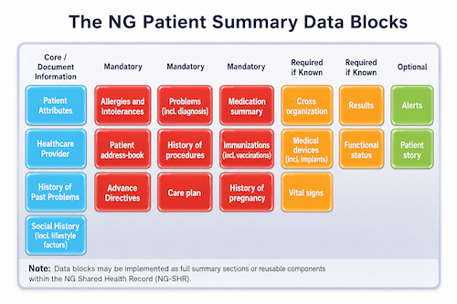

# NG Patient Summary - Nigeria Core - FHIR Implementation Guide v0.0.0

* [**Table of Contents**](toc.md)
* **NG Patient Summary**

## NG Patient Summary

### Purpose

The **Nigeria Patient Summary** defines the Nigeria Core guidance for portable health information sharing across Nigeria. It provides the national basis for a concise, reusable, and interoperable patient summary that can support care at the Primary Health Care (PHC), secondary, and tertiary levels.

Within this guide, the Nigeria Patient Summary is also referred to as the **NG Patient Summary** or as a core expression of the **Nigeria Shared Health Record (NG-SHR)**.

The purpose of the NG Patient Summary is to provide a patient-centred, clinically useful, and standards-based summary that can be shared across organisations, care settings, programmes, facilities, states, and authorised digital health systems in Nigeria.

The NG Patient Summary is intended to support:

* Planned care.
* Scheduled care.
* Unplanned care.
* Emergency care.
* Referrals and counter-referrals.
* Patient movement between PHC, general hospitals, specialist hospitals, and tertiary hospitals.
* Care continuity across public, private, faith-based, and programme-supported facilities.
* Portable patient-held or patient-accessible records.
* Authorised contribution to and retrieval from the Nigeria Shared Health Record.
* Programme-specific summaries that build on the same national baseline.

### Relationship to IPS and NIS ISO 27269

The NG Patient Summary is based on the International Patient Summary (IPS) approach and is aligned with Nigeria’s adoption of the relevant patient summary standard through the Standards Organisation of Nigeria, referenced in this guide as **NIS ISO 27269:2026**.

The International Patient Summary defines a concise patient summary intended to support clinical decision-making at the point of care. It is designed for planned and unplanned care across organisational boundaries and is intentionally minimal, non-exhaustive, specialty-agnostic, and condition-independent.

Nigeria Core adopts these principles for national use and applies them to Nigeria’s decentralised and hybrid digital health architecture. This means that the NG Patient Summary:

* Is **programme-agnostic**.
* Is **specialty-agnostic**.
* Is **condition-independent**.
* Is suitable for **planned, scheduled, unplanned, and emergency care**.
* Is suitable for **cross-organisation exchange within Nigeria**.
* Can be extended by health programmes, specialties, states, and implementers without breaking the core summary.
* Can be used as a portable patient summary, Shared Health Record contribution, or reusable summary data block.

The NG Patient Summary is not intended to be a complete electronic health record. It is a concise, clinically relevant summary that should contain enough information to support safe care when a patient is seen by a new provider, referred to another facility, or reviewed in a different setting.

### Relationship to HL7 FHIR IPS

The HL7 FHIR IPS Implementation Guide specifies how to represent the International Patient Summary using FHIR. Nigeria Core reuses this design pattern and adapts it to Nigerian identifiers, registries, terminology, programmes, privacy rules, and service delivery realities.

Implementers **SHOULD** align NG Patient Summary FHIR artefacts with the HL7 FHIR IPS profiles where applicable, while also applying Nigeria Core constraints.

In particular:

* The NG Patient Summary **SHOULD** be represented as a FHIR document Bundle where a complete portable document is exchanged.
* The first entry in the document Bundle **SHOULD** be a `Composition`.
* The `Composition.section` elements **SHOULD** organise the summary into reusable data blocks.
* The Bundle **SHOULD** contain or reference the resources needed to interpret the summary.
* The summary **SHOULD** include Provenance, author, custodian, originating organisation, and creation date metadata.
* Programme-specific summaries **SHOULD** derive from, profile, or extend the NG Patient Summary rather than redefine a separate unrelated summary.

### Scope of the NG Patient Summary

The NG Patient Summary applies to any setting where concise patient information needs to move with the patient or be retrieved by an authorised provider.

Examples include:

* A PHC referring a pregnant woman to a general hospital.
* A general hospital referring a patient to a tertiary hospital.
* A tertiary hospital sending a discharge summary back to a PHC or general hospital.
* A patient moving from one state to another.
* A patient attending a private facility after receiving care in a public facility.
* A child receiving immunization services from different service delivery points.
* A person enrolled in a disease programme requiring follow-up at another facility.
* A patient needing emergency care where the provider does not have access to the full originating record.
* A patient requesting a portable summary for travel, employment, school, insurance, or continuity of care.

The NG Patient Summary is not limited to a particular disease, programme, specialty, age group, care level, or facility type.

### NG Patient Summary Data Blocks

The NG Patient Summary is organised as reusable data blocks. A data block may correspond to a FHIR `Composition.section`, a group of related FHIR resources, or a reusable section in a programme-specific profile.



The NG Patient Summary uses the following high-level data block categories.

| | | |
| :--- | :--- | :--- |
| Patient Attributes | Mandatory | `Patient`,`RelatedPerson`,`Coverage` |
| Allergies and Intolerances | Mandatory | `AllergyIntolerance` |
| Problems including diagnosis | Mandatory | `Condition` |
| Medication Summary | Mandatory | `MedicationRequest`,`MedicationStatement`,`Medication`,`MedicationDispense` |
| Cross Organization | Mandatory | `Composition`,`Organization`,`Practitioner`,`PractitionerRole`,`Provenance` |
| Healthcare Provider | Required if known | `Practitioner`,`PractitionerRole`,`Organization` |
| Patient Address-book | Required if known | `Patient`,`RelatedPerson`,`Practitioner`,`Organization` |
| History of Procedures | Required if known | `Procedure` |
| Immunization including vaccinations | Required if known | `Immunization`,`Medication`,`Organization` |
| Medical Devices including implants | Required if known | `Device`,`DeviceUseStatement`,`Observation` |
| Results | Required if known | `Observation`,`DiagnosticReport`,`Specimen` |
| Alerts | Required if known | `Flag`,`DetectedIssue`,`Condition`,`AllergyIntolerance`,`DocumentReference` |
| History of Past Problems | Optional | `Condition` |
| Advance Directives | Optional | `Consent`,`DocumentReference`,`Composition` |
| Care Plan | Optional | `CarePlan`,`Goal`,`ServiceRequest` |
| History of Pregnancy | Optional | `Observation`,`Condition`,`Procedure` |
| Vital Signs | Optional | `Observation` |
| Functional Status | Optional | `Observation`,`Condition`,`ClinicalImpression` |
| Patient Story | Optional | `Composition.section`,`DocumentReference`,`QuestionnaireResponse` |
| Social History | Optional | `Observation`,`QuestionnaireResponse` |

### Minimum Mandatory Data Blocks

A conformant NG Patient Summary **SHALL** contain the following mandatory data blocks:

1. **Patient Attributes**
1. **Allergies and Intolerances**
1. **Problems including diagnosis**
1. **Medication Summary**
1. **Cross Organization**

Where clinical data for allergies, problems, or medications are not known, the section **SHALL** still be represented using an appropriate explicit statement such as:

* No known allergies.
* No allergy information available.
* No known current problems.
* Problem information not available.
* No known current medications.
* Medication information not available.

This is important because absence of a section is not the same as known absence of information.

### Patient Attributes

The Patient Attributes data block identifies the patient and provides enough demographic information to support safe matching and continuity of care.

It **SHOULD** include:

* Patient name.
* Date of birth.
* Administrative gender where used.
* Patient identifiers.
* Contact details where available.
* Address or location where available.
* Preferred language where available.
* Insurance or coverage information where applicable.

Nigeria Core implementations **SHOULD** preserve local facility identifiers while also supporting national, state, programme, payer, or Shared Health Record identifiers where available.

### Allergies and Intolerances

The Allergies and Intolerances data block communicates allergy and intolerance information that may affect treatment, prescribing, feeding, referral, procedure planning, or emergency care.

It **SHOULD** include:

* Allergy or intolerance agent.
* Clinical status.
* Reaction or manifestation.
* Severity or criticality where known.
* Onset or end date where known.
* Known absence or unknown status where no allergy information is available.

### Problems Including Diagnosis

The Problems data block communicates active, current, unresolved, or clinically relevant problems and diagnoses.

It **SHOULD** include:

* Problem or diagnosis.
* Problem description.
* Clinical status.
* Severity where known.
* Onset date where known.
* Specialist contact where useful.
* Known absence or unknown status where no problem information is available.

Resolved problems that remain clinically important may be included either in the Problems data block or in the History of Past Problems data block depending on implementation guidance.

### Medication Summary

The Medication Summary data block communicates medications relevant to the patient’s current care.

It **SHOULD** include:

* Current medications.
* Relevant recent medications.
* Prescribed medication.
* Patient-reported medication where clinically relevant.
* Dispensed medication where available.
* Medication status.
* Dose, route, frequency, and duration where available.
* Reason for medication where available.
* Product name, strength, dose form, brand, or active ingredient where available.
* Known absence or unknown status where medication information is not available.

Medication data may come from prescriptions, dispensing systems, facility records, pharmacy systems, programme systems, claims systems, or patient report. Implementations **SHOULD** preserve Provenance and clearly distinguish original orders from reported medication information.

### Cross Organization

The Cross Organization data block supports trusted sharing across organisational boundaries. In Nigeria, this includes exchange across PHCs, general hospitals, tertiary hospitals, states, programmes, regulators, private providers, pharmacies, laboratories, payers, and Shared Health Record services.

The Cross Organization data block **SHALL** include:

* Originating organisation.
* Date of NG Patient Summary creation.

It **SHOULD** also include:

* Authoring healthcare provider.
* Custodian organisation.
* Legal authenticator where applicable.
* Date of last update to the summary content.
* Language of the summary.
* Nature of the summary, such as human-curated, automatically generated, or automatically generated and reviewed.
* Provenance and source information.
* Organisation identifiers, including facility registry identifiers where available.

### Required if Known Data Blocks

The following data blocks are **Required if Known**. They should be included when the data are known, available, and relevant to the summary:

* Healthcare Provider
* Patient Address-book
* History of Procedures
* Immunization including vaccinations
* Medical Devices including implants
* Results
* Alerts

These blocks may be absent where the data are not available or not relevant, but implementations **SHOULD** provide an explicit absence statement where the absence is clinically important.

### Optional Data Blocks

The following data blocks are optional but may be valuable in particular care contexts:

* History of Past Problems
* Advance Directives
* Care Plan
* History of Pregnancy
* Vital Signs
* Functional Status
* Patient Story
* Social History

Optional data blocks **MAY** be required by a derived programme guide, specialty guide, state implementation, facility policy, or Shared Health Record exchange pattern.

For example:

* A maternal health programme may require History of Pregnancy.
* A chronic disease programme may require Care Plan and Vital Signs.
* A disability-focused workflow may require Functional Status and Patient Story.
* A referral workflow may require Healthcare Provider, Results, Care Plan, and Alerts.
* An immunization workflow may require Immunization and portable certificate data.

### Requirement Descriptors

Nigeria Core uses the following requirement descriptors for NG Patient Summary data blocks and data elements.

| | | |
| :--- | :--- | :--- |
| **M - Mandatory** | The element or data block shall always be present. | Missing mandatory data means the instance is not conformant. Where the block is mandatory but clinical content is not available, an explicit absence or unknown statement shall be provided where allowed. |
| **R - Required** | The element or data block shall be present, but exceptions or explicit data absence may be allowed depending on the element. | The receiving system shall be able to understand and process the element. |
| **RK - Required if Known** | The element or data block shall be provided when the information is known or available. | If the information is available, it shall be included. If unavailable, it may be omitted or represented with an appropriate data absent reason depending on the profile. |
| **O - Optional** | The element or data block may be included. | A receiving system may ignore the element, but where included it should follow the applicable Nigeria Core or programme profile. |
| **C - Conditional** | The requirement depends on a stated condition. | If the condition is met, the element shall follow the resulting requirement strength. |

### Conformance Models

Nigeria Core allows multiple levels of conformance for the NG Patient Summary. This is intentional. The NG Patient Summary is designed to be permissive enough for adoption by low-resource systems, while allowing stronger constraints by programmes, states, specialties, and national services over time.

#### Full NG Patient Summary Conformance

A system claiming full NG Patient Summary conformance **SHALL** be able to generate or consume a complete NG Patient Summary document that includes the mandatory data blocks and the applicable required, required-if-known, optional, and conditional data blocks.

Full conformance generally applies to:

* Shared Health Record services.
* HIE platforms.
* Tertiary hospital systems.
* Advanced EMRs.
* National or state repositories.
* Referral platforms.
* Systems participating in conformance testing for complete summary exchange.

#### NG Patient Summary Document Conformance

A system may claim conformance to the NG Patient Summary document structure if it can produce or consume a FHIR document Bundle with a valid `Composition`, mandatory data blocks, and the necessary referenced resources.

This level focuses on the integrity of the document as a portable package.

#### Data Block Conformance

A system may claim conformance to one or more NG Patient Summary data blocks.

For example:

* An immunization system may conform to the Immunization data block.
* A laboratory system may conform to the Results data block.
* A pharmacy system may conform to the Medication Summary data block.
* A device platform may conform to the Medical Devices data block.
* A referral system may conform to Healthcare Provider, Alerts, Results, and Care Plan data blocks.

Data block conformance allows incremental adoption while preserving alignment with the full NG Patient Summary.

#### Programme Extension Conformance

Health programme leads may define programme-specific extensions, derived profiles, examples, and Bundle or Composition patterns based on the NG Patient Summary.

Programme extensions **SHOULD**:

* Preserve the core NG Patient Summary structure.
* Reuse Nigeria Core profiles where applicable.
* Add programme-specific data only where needed.
* Declare which data blocks are mandatory, required, required if known, optional, or conditional for the programme.
* Provide examples and test cases.
* Document whether the programme summary is a full NG Patient Summary, a constrained NG Patient Summary, or a data block-level summary.

### Intentional Permissiveness

The NG Patient Summary is intentionally permissive. It is designed to support adoption across diverse systems, including low-resource PHC systems, paper-to-digital transition systems, state platforms, programme applications, advanced hospital EMRs, and national Shared Health Record services.

This permissive approach allows:

* Minimal summaries to be exchanged safely.
* Programmes to add constraints gradually.
* Systems to adopt data blocks incrementally.
* Existing EMRs and eCHIS platforms to contribute useful data without waiting for full maturity.
* Vendor testing and conformance to mature through the sandbox.
* Future programme and specialty guides to extend the model without fragmenting national interoperability.

### Programme and Specialty Extensions

The NG Patient Summary is programme and specialty agnostic. However, programme and specialty teams may define more specific summaries based on the NG Patient Summary.

Examples include:

* Immunization Summary.
* Maternal and Newborn Summary.
* HIV Continuity of Care Summary.
* TB Treatment Summary.
* Malaria Case Management Summary.
* Nutrition Treatment Summary.
* Non-Communicable Disease Summary.
* Surgical Referral Summary.
* Emergency Care Summary.
* Pharmacy Medication Summary.
* Laboratory Results Summary.
* Medical Device Summary.

Such extensions **SHOULD** appear on the relevant programme or domain page of this Implementation Guide. Each programme page **SHOULD** document the specific `Composition`, `Bundle`, profiles, extensions, terminology, examples, and conformance expectations used for that programme.

Programme-specific summaries may add data, but they **SHOULD NOT** redefine the core NG Patient Summary data blocks in a way that prevents safe processing by a generic NG Patient Summary consumer.

### FHIR Representation

The NG Patient Summary may be represented using several FHIR patterns depending on the use case.

#### FHIR Document Bundle

A complete portable NG Patient Summary **SHOULD** be represented as a FHIR document Bundle.

The Bundle **SHOULD** include:

* `Bundle.type = document`
* A `Composition` as the first entry.
* A `Patient` resource.
* Author and custodian resources.
* Resources referenced by the Composition sections.
* Provenance where applicable.
* A timestamp and identifier.
* Security labels or confidentiality metadata where needed.

#### Composition

The `Composition` resource defines the structure of the NG Patient Summary. Each major data block **SHOULD** be represented as a `Composition.section`.

Composition metadata **SHOULD** include:

* Subject.
* Author.
* Custodian.
* Date.
* Type.
* Title.
* Confidentiality where applicable.
* Attester where applicable.
* Section entries for each data block.

#### DocumentReference

A `DocumentReference` may be used to index, discover, retrieve, or share an NG Patient Summary document.

Example query:

```
GET [base]/DocumentReference?patient=[id]&type=[ng-patient-summary-code]

```

A `DocumentReference` may point to:

* A FHIR document Bundle.
* A PDF rendering.
* A CDA document.
* A signed portable certificate.
* A patient-held document.
* A Shared Health Record summary.

#### Operations

Implementations **MAY** define operations for generating, validating, submitting, or retrieving NG Patient Summaries.

Examples:

```
POST [base]/Patient/[id]/$generate-ng-patient-summary
POST [base]/Bundle/$validate-ng-patient-summary
POST [base]/Bundle/$submit-ng-patient-summary
GET  [base]/DocumentReference?patient=[id]&type=[ng-patient-summary-code]

```

Any such operation **SHOULD** be formally documented using an `OperationDefinition`.

### Use at PHC Level

At PHC level, the NG Patient Summary should support safe referral, continuity of care, and return of information from higher levels.

PHC systems **SHOULD** be able to generate or contribute:

* Patient attributes.
* Current problems.
* Allergies and intolerances.
* Current medications.
* Immunization history.
* Pregnancy status where applicable.
* Recent vital signs.
* Referral note or care plan.
* Relevant observations and test results.
* Originating facility and provider information.

Where PHC systems are offline-first or paper-based, the NG Patient Summary may be generated by a local server, state system, LGA-supported platform, eCHIS system, or referral platform.

### Use at Secondary Level

At secondary level, the NG Patient Summary should support referral triage, specialist review, admission, discharge, and continuity back to PHC or onward to tertiary care.

Secondary facilities **SHOULD** be able to generate or consume:

* Full mandatory NG Patient Summary data blocks.
* Referral context.
* Diagnostic results.
* Medication changes.
* Procedures.
* Discharge information.
* Care plan.
* Follow-up instructions.
* Specialist contact.
* Alerts.
* Facility and provider provenance.

### Use at Tertiary Level

At tertiary level, the NG Patient Summary should support advanced care, specialist consultation, inter-facility referral, discharge planning, and longitudinal Shared Health Record updates.

Tertiary systems **SHOULD** support:

* Full NG Patient Summary conformance where feasible.
* Complex diagnostic results.
* Procedure history.
* Specialist care plans.
* Medication reconciliation.
* Device and implant information.
* Clinical notes and discharge summaries.
* Shared Health Record contribution.
* Programme-specific extensions.
* Provenance, audit, and authorisation metadata.

### Portable Certificates

The NG Patient Summary framework may also support portable certificates. A portable certificate is a focused, verifiable, patient-held or patient-accessible health document that communicates a specific health status, service, event, or entitlement.

Examples include:

* COVID-19 vaccination certificate.
* Routine immunization certificate.
* Yellow fever vaccination certificate.
* School health certificate.
* Fit-to-travel or fit-to-work health certificate.
* Laboratory result certificate.
* Programme enrolment certificate.
* Treatment completion certificate.
* Disability or functional assessment certificate where authorised.

Portable certificates may be represented as:

* A constrained NG Patient Summary.
* A programme-specific FHIR document Bundle.
* A `Composition` with focused sections.
* A `DocumentReference` pointing to a signed document.
* A PDF or printable certificate with a QR code.
* A digitally signed FHIR Bundle.
* A verifiable credential or other approved certificate format where supported.

Portable certificates **SHOULD** include:

* Patient identity.
* Issuing organisation.
* Issuing provider or authority.
* Certificate type.
* Date of issue.
* Relevant clinical event or status.
* Validity period where applicable.
* Verification information.
* Signature or tamper-evidence where required.
* Link to authoritative verification service where applicable.

For immunization certificates, the certificate **SHOULD** reference or include `Immunization` resources and should align with the Immunization section of this Implementation Guide. The Immunization guidance page may define more specific examples and constraints for COVID-19, routine immunization, travel vaccination, and other vaccination certificates.

Portable certificates **SHOULD NOT** expose more patient information than needed for the certificate purpose.

### Candidate and Additional NG SHR Data

The NG Patient Summary is minimal and non-exhaustive. Additional data may be useful for specific programmes, specialties, states, or care settings.

Such additional data may be included as **Candidate NG SHR Data** when:

* It is clinically useful for the care event.
* It does not change the meaning of the core NG Patient Summary.
* It is clearly identified as programme-specific, specialty-specific, or implementation-specific.
* It follows Nigeria Core privacy, security, terminology, and Provenance requirements.
* It is documented by the programme or implementation guide where conformance testing is expected.

Candidate NG SHR Data may not be testable for generic NG Patient Summary conformance unless it is formally defined by Nigeria Core or a derived programme guide.

### Missing Data and Known Absence

The NG Patient Summary **SHOULD** distinguish between:

* Data not captured.
* Data not available to the source system.
* Data suppressed due to consent or privacy rules.
* Data intentionally omitted to keep the summary concise.
* Known absence of a condition, allergy, medication, or event.
* Unknown status.

Mandatory clinical sections should not simply disappear because no data are present. Where the section is mandatory and the content is absent, the summary **SHOULD** include a clear coded or narrative statement indicating known absence or unknown status.

### Currency and Timeliness

The NG Patient Summary is a snapshot in time. The summary **SHOULD** clearly state:

* Date of creation.
* Date of last update to content.
* Source organisation.
* Author or generating system.
* Whether it was automatically generated, human-curated, or reviewed.
* Relevant event dates within each section.

Systems **SHOULD** avoid presenting old information as current. Where data are old but clinically relevant, the relevant dates and Provenance **SHOULD** be preserved.

### Terminology

The NG Patient Summary **SHOULD** use Nigeria Core terminology and mappings where available.

Terminology may include:

* Nigeria Core CodeSystems and ValueSets.
* Programme-specific ValueSets.
* ICD-11.
* SNOMED CT.
* LOINC.
* ATC.
* UCUM.
* IDMP-aligned medication identifiers where available.
* Local facility, programme, or regulator codes with ConceptMaps to national or international standards.

Where local codes are used, systems **SHOULD** include clear system URIs and display text. Where possible, systems **SHOULD** also include mapped national or international codes.

### Provenance and Trust

Trust is essential for portable patient summaries. The NG Patient Summary **SHOULD** include Provenance sufficient for the receiver to understand:

* Who authored the summary.
* Which organisation generated it.
* When it was created.
* When the content was last updated.
* Whether it was generated automatically or curated by a human.
* What source systems contributed to it.
* Whether any data were transformed, reconciled, or imported.
* Which organisation is accountable for the summary.

Cross-organisation exchange **SHOULD** reference trusted facility, provider, regulator, and registry identifiers where available.

### Privacy and Security

The NG Patient Summary may contain sensitive health information. Systems **SHALL** protect it using the privacy, consent, access control, audit, and security requirements defined in the [Security] page.

Implementations **SHOULD**:

* Apply role-based and organisation-based access control.
* Respect consent and purpose-of-use restrictions.
* Apply security labels where special handling is needed.
* Avoid exposing sensitive information in public dashboards, logs, QR codes, or notifications.
* Use synthetic summaries in sandbox and public testing environments.
* Minimise data in portable certificates.
* Audit summary generation, access, export, and sharing.
* Protect attachments and Binary resources.
* Apply Nigerian data protection, institutional, programme, and regulatory requirements.

### Relationship to Programme Pages

Programme pages in this Implementation Guide may define examples and specific extensions of NG Patient Summary `Composition` and `Bundle` structures.

For example:

* The Immunization page may define vaccination summary and portable vaccination certificate examples.
* The MNCH page may define pregnancy and newborn summary examples.
* The HIV page may define HIV continuity of care summaries with additional consent controls.
* The TB page may define treatment and laboratory monitoring summaries.
* The Malaria page may define case management and diagnostic result summaries.
* The Nutrition page may define nutrition enrolment and follow-up summaries.
* The Pharmacy page may define medication summary and ePrescription-linked summaries.
* The Claims page may define payer-facing summaries with strict data minimisation.

Each programme page **SHOULD** state whether its summary is:

* A full NG Patient Summary.
* A constrained NG Patient Summary.
* A data-block-level summary.
* A portable certificate.
* A programme-specific extension of the NG SHR.

### Conformance Expectations

Systems claiming conformance to this page **SHOULD** declare one or more of the following:

* Full NG Patient Summary producer.
* Full NG Patient Summary consumer.
* NG Patient Summary document producer.
* NG Patient Summary document consumer.
* Data block producer.
* Data block consumer.
* Portable certificate producer.
* Portable certificate verifier.
* Programme extension producer or consumer.
* Shared Health Record contributor.
* Shared Health Record responder.

Conformance claims **SHOULD** be documented in CapabilityStatements and tested in the Nigeria Core sandbox where available.

### Example Summary Exchange Scenarios

#### PHC to General Hospital Referral

A PHC generates an NG Patient Summary containing patient attributes, current problems, allergies, medications, pregnancy status, recent vital signs, immunizations, referral note, and originating organisation metadata. The receiving general hospital uses the summary for triage and continuity of care.

#### General Hospital to Tertiary Hospital Referral

A general hospital generates a richer NG Patient Summary containing diagnostic reports, procedures, medication changes, allergies, active problems, alerts, care plan, and specialist contact information. The tertiary hospital consumes the summary and updates it after specialist review.

#### Tertiary Hospital Discharge Back to PHC

A tertiary hospital generates a discharge-oriented NG Patient Summary containing diagnoses, procedures, medication summary, follow-up care plan, pending results, alerts, and referral-back instructions. The PHC uses the summary for follow-up care.

#### Patient-Held Portable Summary

A patient accesses a portable NG Patient Summary through a patient-facing application, QR code, secure document link, or printed document. The summary contains only the minimum authorised information needed for care continuity.

#### Portable Immunization Certificate

An immunization system generates a focused certificate using NG Patient Summary principles. The certificate includes patient identity, vaccine information, dates, issuer, verification link, and digital signature where required. More detailed guidance is provided in the Immunization page.

### Implementation Notes

Implementers should consider the following:

* The NG Patient Summary should be implemented as a reusable core of the Nigeria Shared Health Record.
* The summary is not a replacement for full EMRs, clinical notes, or programme systems.
* Mandatory data blocks should be present even when the content indicates known absence or unknown status.
* Programme-specific extensions should preserve the NG Patient Summary structure.
* The summary should be concise and clinically relevant.
* The summary should support both human-readable narrative and computable FHIR resources.
* Summary generation may be manual, automated, or hybrid.
* Summary consumers should be able to safely process unknown, absent, optional, and additional data.
* Portable certificates should be minimal, verifiable, and purpose-specific.
* Sandbox testing should include PHC, secondary, tertiary, Shared Health Record, referral, and portable certificate scenarios.

Footnotes

